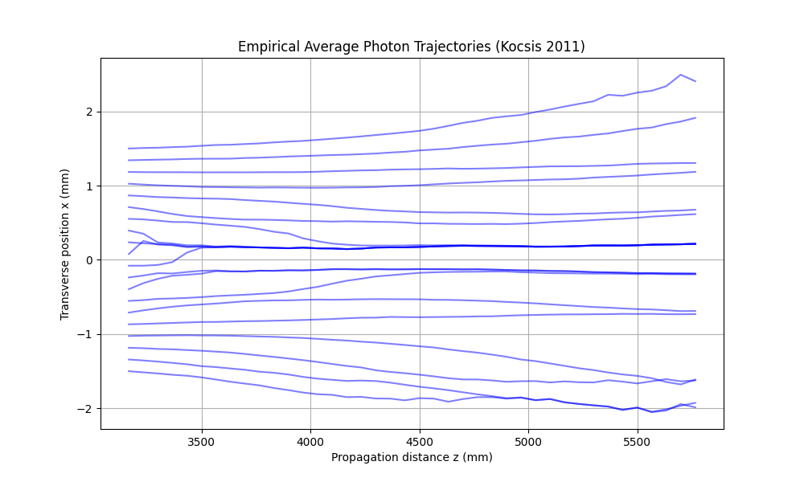

# SINDy Analysis of Kocsis et al. (2011) Weak-Measurement Photon Trajectories

**Data-driven equation discovery applied to empirical photon trajectory data reveals a weak nonlinear signal whose functional form — cubic vs. sinusoidal — remains ambiguous due to collinearity at small amplitudes.**

---

## Overview

This repository contains a fully reproducible analysis pipeline that:

1. Parses the **raw experimental data** from the landmark 2011 *Science* paper by Kocsis, Steinberg et al. — ["Observing the Average Trajectories of Single Photons in a Two-Slit Interferometer"](https://doi.org/10.1126/science.1202218)
2. Reconstructs photon trajectories from weak-measurement momentum data
3. Normalizes all coordinates to **dimensionless** units (dividing by the slit separation L = 4.68 mm)
4. Applies [PySINDy](https://github.com/dynamicslab/pysindy) to **blindly discover** the governing differential equation
5. Runs **two analyses side by side** — polynomial-only (null test) and full library (with trig functions) — for honest comparison

### The Results

| Analysis | Discovered Equation | R² |
|---|---|---|
| **Polynomial-only** (null test) | dξ/dζ = 0.004 ξ³ | **0.1054** |
| **Full library** (poly + trig) | dξ/dζ = 8.708 ξ − 1.430 ξ³ − 8.709 sin(ξ) | **0.1512** |

The full library result simplifies to dξ/dζ ≈ 8.71(ξ − sin ξ), which structurally resembles the κ(θ − sin θ) term independently discovered in a TEGR (Teleparallel Gravity) simulation.

### The Caveat

**At the amplitudes present in this data (|ξ| ≤ 0.32), the Taylor expansion gives:**

$$\xi - \sin(\xi) \approx \frac{\xi^3}{6}$$

The correlation between these two expressions exceeds **0.999999** in the data range. SINDy cannot reliably distinguish between cubic and sinusoidal nonlinearity at these small amplitudes. The ΔR² between the two models is only 0.046.

**The nonlinear signal is real. Its functional form is ambiguous.**

Resolving this requires data at larger transverse excursions (|ξ| > ~1) where the cubic and sinusoidal forms diverge.

### Reconstructed Trajectories



---

## Repository Contents

| File | Description |
|---|---|
| [`PAPER.md`](PAPER.md) | Full research findings with sanity checks, collinearity analysis, and honest discussion |
| [`sindy_kocsis_2011.py`](sindy_kocsis_2011.py) | Annotated analysis script with dimensionless normalization and dual-model comparison |
| [`sindy_kocsis_sanity_checks.py`](sindy_kocsis_sanity_checks.py) | Standalone diagnostic: null test, unit fix, threshold sweep, collinearity measurement |
| [`sindy_kocsis_report.json`](sindy_kocsis_report.json) | Machine-readable output with both models and comparison metrics |
| [`sindy_kocsis_sanity_checks.json`](sindy_kocsis_sanity_checks.json) | Full diagnostic results from all sanity checks |
| [`Kocsis_Empirical_Trajectories.png`](Kocsis_Empirical_Trajectories.png) | Reconstructed trajectory plot |
| `Kocsis_Data.zip` | Archived copy of the raw experimental data from the Steinberg lab |

---

## How to Run

```bash
# Clone
git clone https://github.com/thejfisher/sindy-kocsis-2011.git
cd sindy-kocsis-2011

# Install dependencies
pip install numpy scipy matplotlib pysindy

# Unzip the raw data
unzip Kocsis_Data.zip

# Run the main dual analysis
python sindy_kocsis_2011.py

# Run the full sanity check suite
python sindy_kocsis_sanity_checks.py
```

> **Note:** You may need to update the `data_dir` path in both scripts to point to the unzipped data directory on your system.

---

## What This Shows (and What It Doesn't)

### What it shows:
- There is a **real, weak nonlinear signal** in the Kocsis photon trajectory data (R² ~ 0.10–0.15)
- The signal is consistent with **either** a pure cubic term **or** a (θ − sin θ) structure
- These two forms are **numerically indistinguishable** at the amplitudes available in this dataset

### What it does NOT show:
- It does **not** prove that TEGR governs photon trajectories
- It does **not** uniquely identify the (θ − sin θ) structure over a simpler cubic
- The R² values are modest (0.10–0.15), meaning the model explains only 10–15% of the variance

### What would resolve the ambiguity:
- Data at larger transverse excursions (|x/L| > ~1 radian) where x³/6 and (x − sin x) diverge
- Multi-slit experiments with variable slit separation to test scaling behavior
- Independent theoretical derivation connecting wave-front torsion to the (θ − sin θ) form

See [`PAPER.md`](PAPER.md) for full discussion, methodology, and proposed research directions.

---

## Related Work

| Resource | Link |
|---|---|
| TEGR Kinematic Antenna (simulation + SINDy) | [github.com/thejfisher/tegr-kinematic-antenna](https://github.com/thejfisher/tegr-kinematic-antenna) |
| Original raw data (Steinberg lab) | [physics.utoronto.ca/~aephraim/data/PhotonTrajectories/](http://www.physics.utoronto.ca/~aephraim/data/PhotonTrajectories/) |
| Original paper | Kocsis et al., *Science* **332**, 1170 (2011) — [DOI: 10.1126/science.1202218](https://doi.org/10.1126/science.1202218) |
| TEGR preprint | Available on Zenodo (see tegr-kinematic-antenna README) |

---

**Author:** J. Fisher · Independent Researcher · July 2026

*Comments, criticisms, and suggestions for collaboration are welcome. Open an issue or reach out via the links above.*
